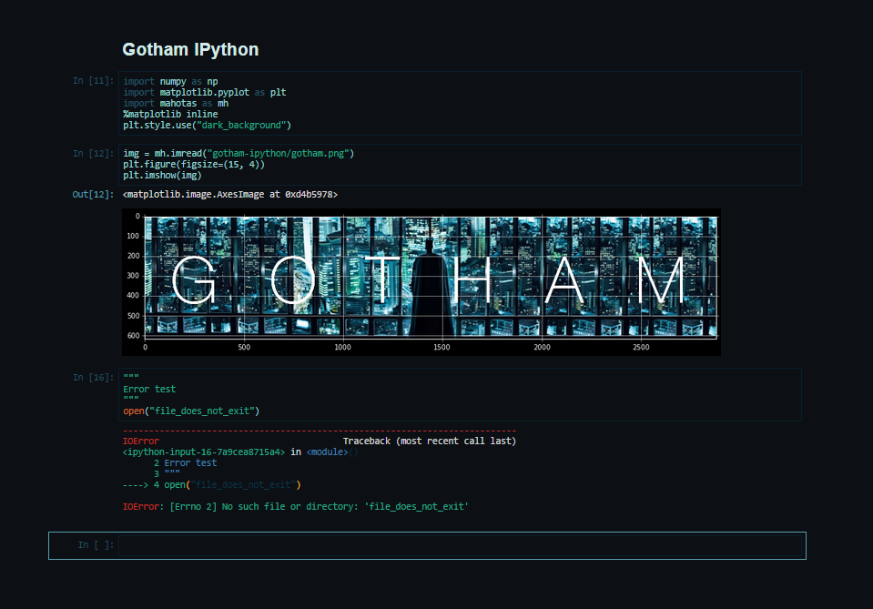

# Gotham IPython

## About

Gotham IPython is a **dark** color scheme for IPython Notebook 3 (Jupyter*ish* v3 might have different arrangement of divs, so no guarantee for v2). It is based on emacs color scheme [gotham-theme](https://github.com/wasamasa/gotham-theme) which itself is a port of the vim version [vim-gotham](https://github.com/whatyouhide/vim-gotham).

## Screenshot

### Installation

Copy `custom.css` to `~./ipython/profile_default/static/custom/custom.css`

At present, the CSS is only implemented for the main notebook div, neither for toolbar (which is hidden) nor for IPython landing page. And I don't have much motivation to fix this.

Go to [gotham-contrib](https://github.com/whatyouhide/gotham-contrib) for the scheme for other editors / terminal emulators.
